# Signal

An autonomous agent that watches for new information, remembers what it has already reported, drafts a briefing, critiques its own draft, and reports back — without any human triggering each run.

Built for the AWS Builder Center "Build an Always-On Agent" Weekend Challenge.

---

## 📌 Overview

**Signal** is an autonomous AI agent built for the **AWS Weekend Agent Challenge**.

Instead of waiting for a user to click a button, Signal runs **unattended** on a schedule or in response to an event.

Every execution performs the following workflow:

- Fetches the latest Hacker News stories
- Remembers stories already reported
- Filters out duplicates
- Uses Amazon Bedrock (Nova Micro) to generate an AI morning briefing
- Reviews and improves its own draft using a second AI pass
- Sends the final report via Amazon SES
- Stores execution history for future runs

The result is an intelligent daily briefing system that continuously works in the background.

---
---

# ✨ Features

- 🤖 Fully autonomous AI agents
- 🧠 Persistent memory using Amazon DynamoDB
- 📰 Fetches live Hacker News stories
- 👀 Continuously watches for new trending stories
- 🚫 Avoids duplicate reporting using persistent memory
- ✍️ AI-generated summaries using Amazon Nova Micro
- 🔍 Self-critiques and improves generated content before delivery
- 📧 Sends automated Morning Brief emails via Amazon SES
- 🚨 Sends Watcher Alert emails when important new stories appear
- ⏰ Scheduled unattended execution using Amazon EventBridge Scheduler
- ⚡ Event-driven execution using Amazon S3
- 🌐 REST API exposed through Amazon API Gateway
- 📊 Live public dashboard displaying the latest agent activity
- ☁️ Fully serverless AWS architecture

---

## Architecture

```
EventBridge (daily 6AM) ─┐
EventBridge (hourly)  ───┼──► Lambda: signal-agent ──► Bedrock (draft + self-critique)
S3 event (file upload) ──┘                          ──► SES (email)
                                                      ──► DynamoDB (memory + run log)
                                                              │
                                                              ▼
                                          Lambda: signal-dashboard-api
                                                              │
                                                              ▼
                                              API Gateway (HTTP API)
                                                              │
                                                              ▼
                                       S3 static site (public dashboard)
```

---

# ☁ AWS Services Used

| Service | Purpose |
|----------|---------|
| AWS Lambda | Executes the autonomous agent |
| Amazon Bedrock | AI reasoning and summarization |
| Amazon Nova Micro | LLM used for report generation |
| Amazon DynamoDB | Persistent memory of reported stories |
| Amazon SES | Sends the generated email |
| Amazon EventBridge Scheduler | Daily unattended execution |
| Amazon S3 | Event-based trigger |
| Amazon API Gateway | Exposes REST API endpoints powering the live dashboard |
| Amazon CloudWatch | Monitoring and logs |
| IAM | Secure permissions |

---


## Files
- `lambda_function.py` — main agent: fetch → filter unseen → plan/draft (Bedrock) → self-critique (Bedrock) → email (SES) → log (DynamoDB). Also handles hourly "watcher" mode for anomaly alerts.
- `dashboard/dashboard_api.py` — Lambda backing the public dashboard's `/runs` and `/feedback` API routes.
- `dashboard/index.html` — static dashboard page, hosted on S3, showing live run history.
- `screenshots/` — proof of unattended operation (see below).

## Live Dashboard
http://signal-agent-dashboard-rebeccavio12262.s3-website-us-east-1.amazonaws.com/

## Video Walkthrough
https://drive.google.com/file/d/14BRrJJK4YxDxJZsOCxefY-trffHeMfx2/view?usp=sharing

## Amazon Bedrock

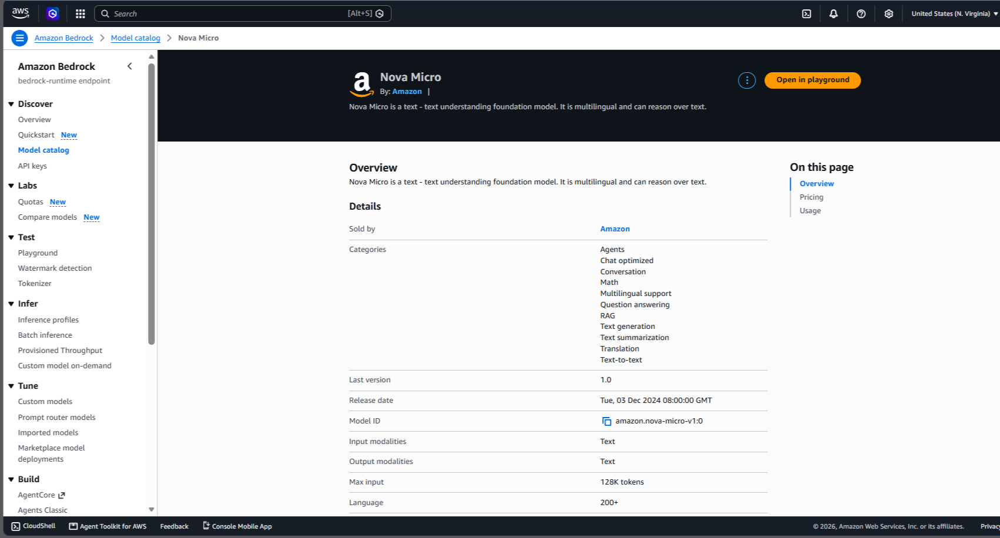

---

## DynamoDB Table

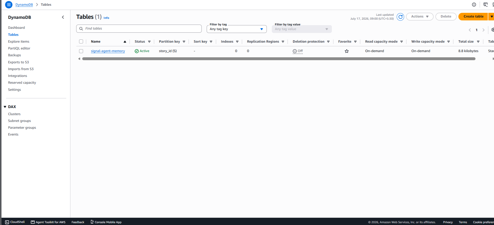

---

## DynamoDB Items

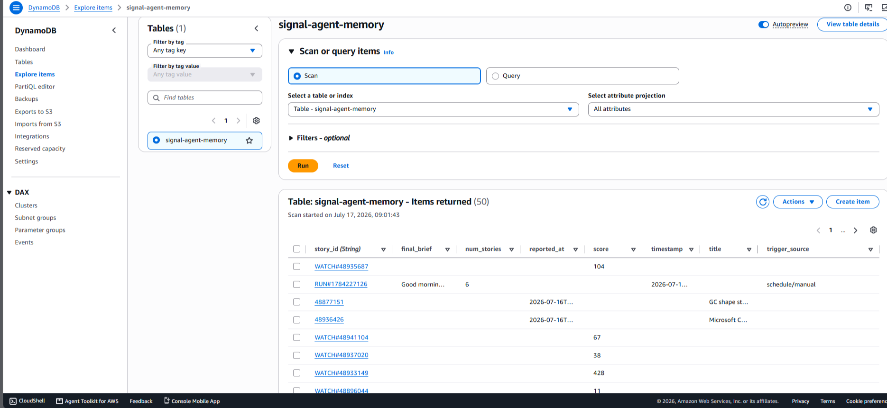

---

## Amazon S3

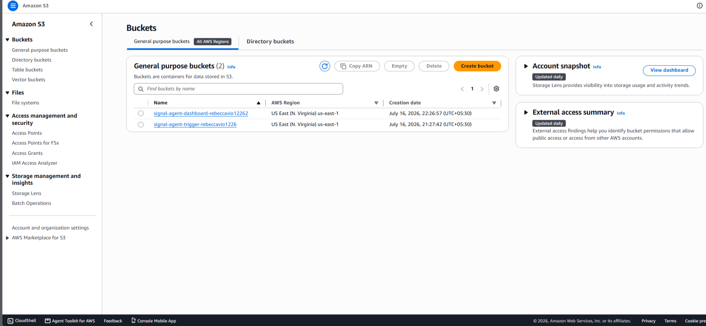

---

## AWS Lambda

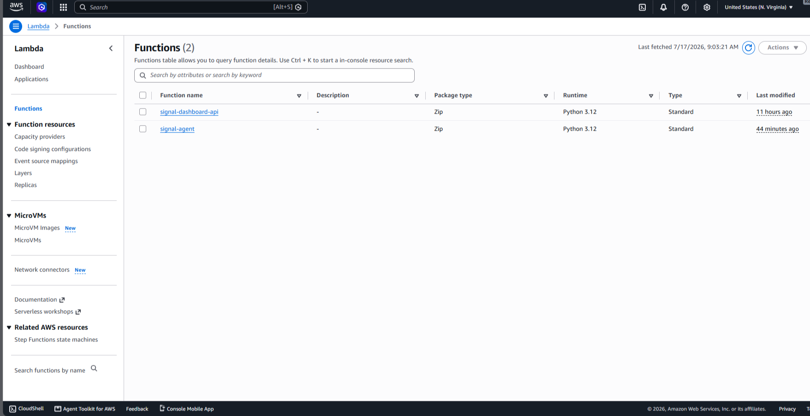

---

## Lambda Configuration

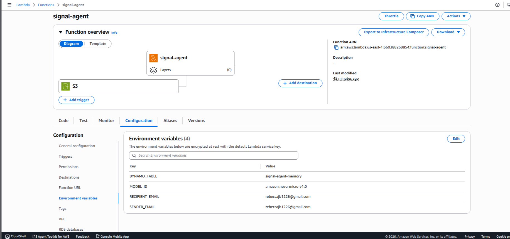

---

## Lambda Source Code

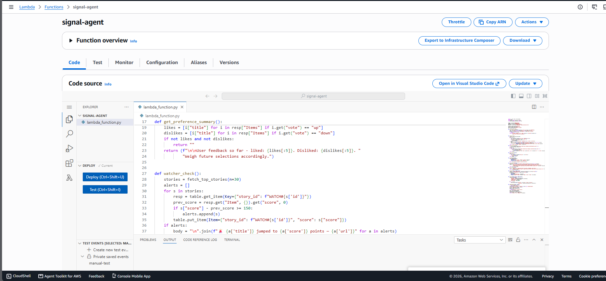

---

## CloudWatch Logs

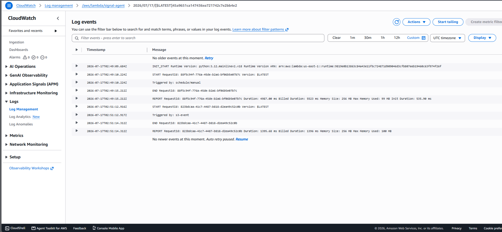

---

## EventBridge Scheduler

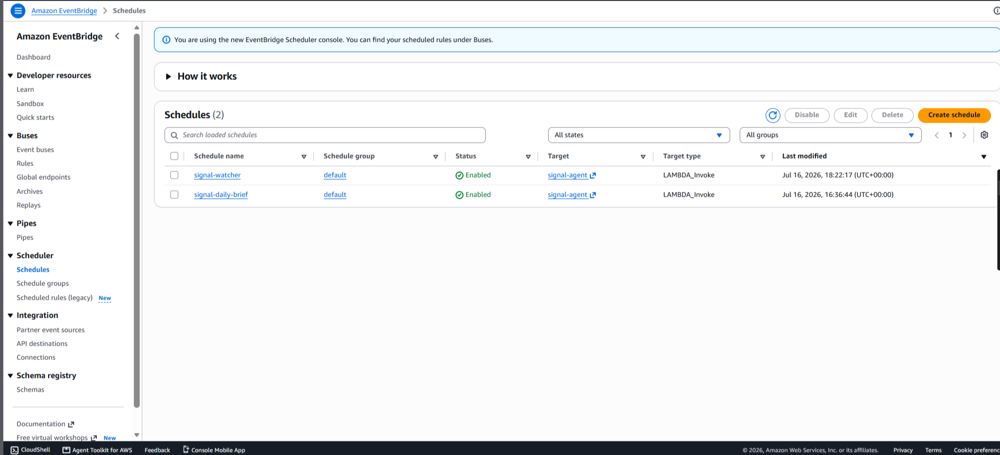

---

## Generated Email

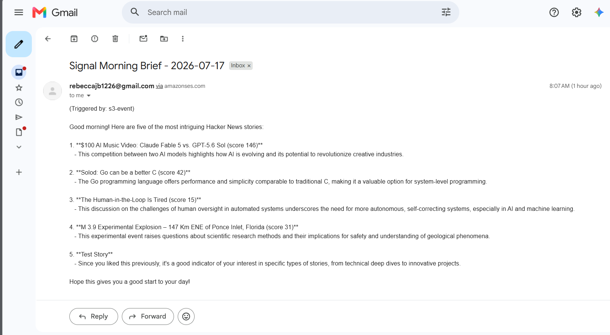

---

## Live Dashboard

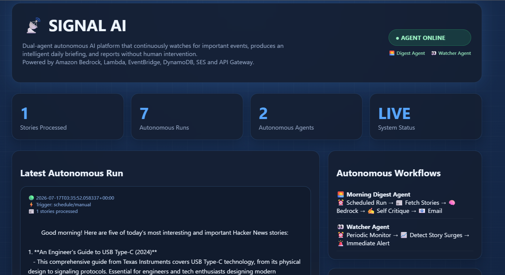

---

## API Gateway

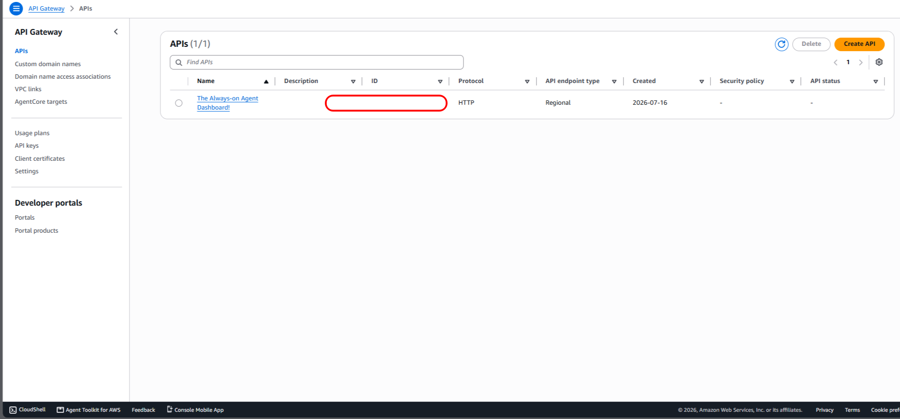


---

# 📸 Demonstration

The repository includes screenshots demonstrating:

- ✅ Bedrock Model Access
- ✅ Lambda Deployment
- ✅ Environment Variables
- ✅ Successful Lambda Execution
- ✅ CloudWatch Logs
- ✅ DynamoDB Memory
- ✅ EventBridge Scheduler
- ✅ Amazon S3 Trigger
- ✅ Generated Email
- ✅ Autonomous Execution

---
---

# 🔐 Security

- IAM roles follow least-privilege principles for the hackathon environment.
- Secrets are stored using Lambda environment variables.
- Email sending is restricted to verified identities in Amazon SES.

---

# 📈 Future Improvements

- User preferences
- Multiple news sources
- Slack / Discord notifications
- Daily digest personalization
- RSS feed support
- Web dashboard
- Sentiment analysis
- Multi-agent collaboration
- Vector database memory
- Amazon Bedrock Knowledge Bases

---

# 🎯 Challenge Requirements

✅ Autonomous AI agent

✅ Runs unattended

✅ Triggered automatically

✅ Reports results back

✅ Uses AWS services

✅ AI-powered reasoning

---
## ⭐ If you found this project interesting, consider giving it a star!
